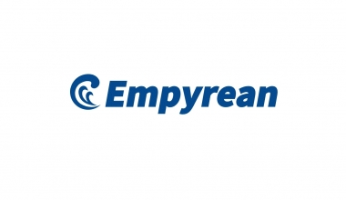

# 太维（TaiWei）：三维系统集成自主智能物理设计平台

太维（TaiWei）是我国首个支持系统工艺协同优化（STCO）的自主智能三维物理设计软件平台。项目面向后摩尔时代的高性能计算、人工智能等复杂系统芯片设计需求，致力于突破三维系统集成在物理设计方面的技术瓶颈。

## 快速入门

快速上手指南请参考：

- [TaiWei 快速入门](DOC/TaiWei-QuickStart.md)

## 项目背景

进入后摩尔时代，单纯依赖工艺微缩已难以持续支撑高性能计算、人工智能等复杂系统芯片对性能、能效与集成度的需求。以芯粒化、三维堆叠和异构集成为代表的三维系统集成，正在成为突破系统级瓶颈的关键技术路径。

然而，三维系统集成并非二维设计方法的简单延伸，其在跨层互连、设计约束、工艺—设计耦合关系等方面发生了根本变化，对芯片物理设计方法与工具体系提出了全新要求。

## 核心问题

当前三维系统集成面临的核心瓶颈在于缺乏与三维结构相匹配的系统化物理设计能力：

- **工具链局限**：现有主流物理设计工具链大多建立在二维工艺假设之上，对高密度跨层互连、非均匀供电与热约束等三维特性缺乏原生支持
- **设计基础不匹配**：标准单元库、设计规则与技术抽象文件并非面向三维系统集成定制，导致布局布线阶段频繁暴露系统性问题
- **效率与可复现性**：依赖大量人工建模与流程拼接，效率低且不可复现

## 解决方案

项目提出面向三维系统集成的"设计基础—核心工具—智能控制"三位一体总体解决方案，从设计方法、工具能力与流程智能化三个层面系统性重构三维物理设计技术体系。

### 总体架构

平台采"设计基础使能—核心执行—智能控制"三层体系，并通过 STCO 与 AI Agent 构建双重闭环，实现三维物理设计流程的系统级协同与智能优化。

#### 1. 设计基础使能层

- 研发三维感知的系统工艺协同优化（STCO）引擎
- 通过多物理场建模与快速模块级别评估
- 自动生成布局布线友好的标准单元库、三维设计规则与技术抽象文件（如 3D Tech LEF）
- 协同优化的供电与散热方案
- 将"可布通、可收敛"的目标前置到设计基础生成阶段

#### 2. 核心执行工具层

- 原生支持三维堆叠与异构集成的全流程物理设计软件平台
- 覆盖完整流程：综合、三维规划与划分、布局、时钟树综合、布线、寄生参数提取、多维签核分析
- 采用统一的三维数据模型与接口规范，确保跨阶段一致性与可扩展性
- 面向三维约束的原生布局布线与分析引擎
- 可插拔、可演进、可验证的自主工具体系

#### 3. 智能控制层

- 引入云原生与大模型技术
- 构建嵌入式的智能物理设计优化体
- 实现对复杂设计流程的自主感知、推理与决策
- 通过解析设计日志、报告和结构化指标，理解设计状态与瓶颈成因
- 形成跨阶段、多目标的自动化优化闭环

## 核心特性

- **自主可控**：完全自主知识产权的三维物理设计软件平台
- **系统工艺协同优化（STCO）**：从设计基础阶段开始优化，实现工艺与设计的深度融合
- **原生三维支持**：针对三维堆叠与异构集成的原生设计能力
- **智能化**：基于 AI Agent 的自动化优化与决策
- **全流程覆盖**：从综合到签核的完整物理设计流程
- **产业级验证**：与行业领先企业联合验证与应用

## 产业落地

项目将依托 EDA² 平台的工程环境与评测体系，并与国内领先的半导体企业开展联合验证与集成应用。
通过真实集成电路设计任务进行系统性验证，形成从技术研发、平台实现到工程应用的完整闭环，加速研究成果向产业级 EDA 工具与设计方法的转化。

### 合作伙伴

<table style="border: none; border-collapse: collapse;">
<tr>
<td align="center" width="200" style="padding: 20px; border: none;">

</td>
<td align="center" width="200" style="padding: 20px; border: none;">

</td>
<td align="center" width="200" style="padding: 20px; border: none;">

</td>
<td align="center" width="200" style="padding: 20px; border: none;">

</td>
</tr>
</table>

## 项目目标

项目最终将交付一套高性能、自主可控的三维物理设计软件平台，并建立从底层工艺协同到顶层智能优化的全新设计范式，为我国高端芯片设计实现从"工具替代"向"体系构建"和"范式引领"的跨越提供核心支撑。

## 联系方式
欢迎就本项目的技术交流、科研合作及产业合作事宜与我们联系。
*   **[王志昂](https://icmne.fudan.edu.cn/97/b8/c48925a759736/page.htm)**：助理教授，复旦大学集成芯片与系统全国重点实验室/集成电路与微纳电子创新学院
*   **邮箱**： [zhiangwang@fudan.edu.cn](mailto:zhiangwang@fudan.edu.cn)

